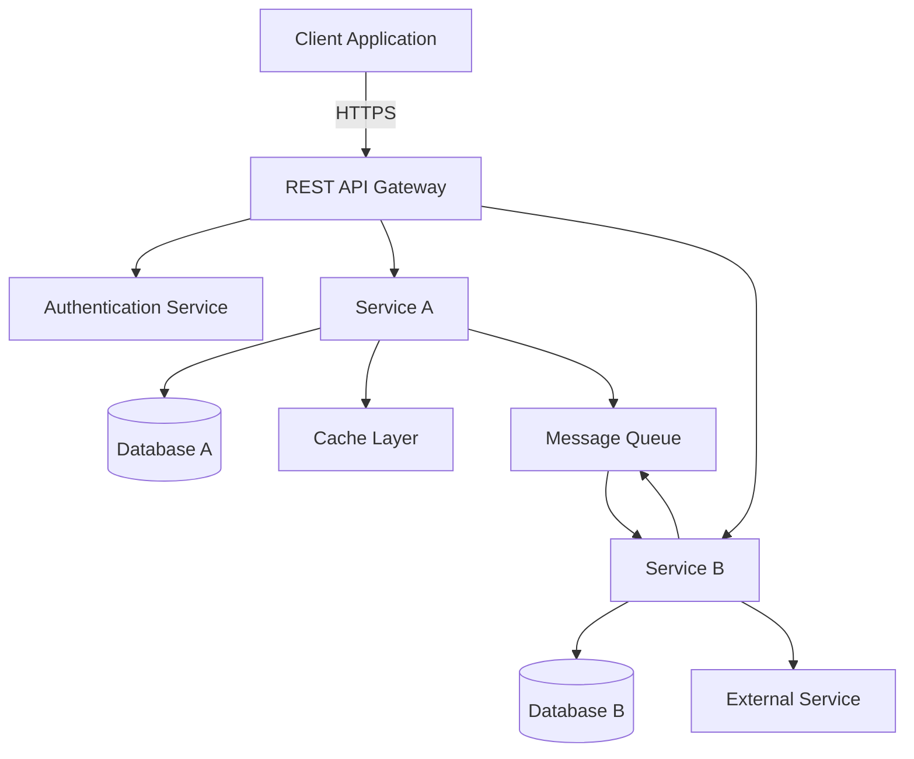

# Architecture Overview

Below is a high-level architecture overview represented using a Mermaid diagram.

```mermaid
graph TD
    Client[Client Application]
    API[REST API Gateway]
    Auth[Authentication Service]
    ServiceA[Service A]
    ServiceB[Service B]
    DBA[(Database A)]
    DBB[(Database B)]
    Cache[Cache Layer]
    MQ[Message Queue]
    Ext[External Service]

    Client -->|HTTPS| API
    API --> Auth
    API --> ServiceA
    API --> ServiceB
    ServiceA --> DBA
    ServiceA --> Cache
    ServiceA --> MQ
    ServiceB --> DBB
    ServiceB --> MQ
    MQ --> ServiceB
    ServiceB --> Ext
```