# Architecture Overview

This document provides a comprehensive architecture overview of the COBOL Account Management System, including the current implementation and future modernization considerations.

## Current System Architecture

The legacy COBOL Account Management System follows a three-tier architecture pattern with modular separation of concerns:

```mermaid
graph TD
    User[👤 User<br/>Terminal Interface]
    
    subgraph "Presentation Layer"
        Main[main.cob<br/>MainProgram<br/>📋 Menu System]
    end
    
    subgraph "Business Logic Layer"
        Ops[operations.cob<br/>Operations<br/>💼 Business Rules<br/>& Validation]
    end
    
    subgraph "Data Layer"
        Data[data.cob<br/>DataProgram<br/>💾 Storage Access]
        Storage[(Working Storage<br/>STORAGE-BALANCE<br/>$1,000.00 default)]
    end
    
    User -->|Menu Selection<br/>1-4| Main
    Main -->|CALL with Operation Type<br/>TOTAL/CREDIT/DEBIT| Ops
    Ops -->|CALL with READ/WRITE<br/>+ Balance Parameter| Data
    Data -->|Access| Storage
    Ops -->|Transaction Results<br/>Balance Updates| User
    Main -->|Menu Display<br/>System Messages| User
    
    classDef presentation fill:#e1f5fe
    classDef business fill:#f3e5f5
    classDef data fill:#e8f5e8
    classDef storage fill:#fff3e0
    
    class Main presentation
    class Ops business
    class Data data
    class Storage storage
```

## System Component Details

### Core Components

| Component | File | Responsibility | Key Features |
|-----------|------|----------------|--------------|
| **Presentation Layer** | `main.cob` | User Interface & Menu System | Menu-driven interface, Input validation, Program flow control |
| **Business Logic Layer** | `operations.cob` | Account Operations & Business Rules | Balance inquiry, Credit/Debit processing, Insufficient funds validation |
| **Data Layer** | `data.cob` | Data Storage & Retrieval | Read/Write operations, Balance persistence (session-only) |

### Data Flow Architecture

```mermaid
sequenceDiagram
    participant U as 👤 User
    participant M as main.cob<br/>(Presentation)
    participant O as operations.cob<br/>(Business Logic)
    participant D as data.cob<br/>(Data Access)
    participant S as Working Storage<br/>(STORAGE-BALANCE)

    Note over U,S: Account Balance Inquiry Flow
    U->>M: Select "1. View Balance"
    M->>O: CALL 'Operations' USING 'TOTAL '
    O->>D: CALL 'DataProgram' USING 'read', BALANCE
    D->>S: Read STORAGE-BALANCE
    S->>D: Return balance value
    D->>O: Return current balance
    O->>U: DISPLAY "Current balance: $XXX.XX"
    O->>M: GOBACK
    M->>U: Show menu again

    Note over U,S: Credit Transaction Flow
    U->>M: Select "2. Credit Account"
    M->>O: CALL 'Operations' USING 'CREDIT'
    O->>U: DISPLAY "Enter credit amount:"
    U->>O: Input amount
    O->>D: CALL 'DataProgram' USING 'read', BALANCE
    D->>S: Read current balance
    S->>D: Return balance
    D->>O: Return balance
    O->>O: ADD AMOUNT TO FINAL-BALANCE
    O->>D: CALL 'DataProgram' USING 'WRITE', NEW-BALANCE
    D->>S: Update STORAGE-BALANCE
    O->>U: DISPLAY "Amount credited. New balance: $XXX.XX"

    Note over U,S: Debit Transaction Flow (with validation)
    U->>M: Select "3. Debit Account"
    M->>O: CALL 'Operations' USING 'DEBIT '
    O->>U: DISPLAY "Enter debit amount:"
    U->>O: Input amount
    O->>D: CALL 'DataProgram' USING 'read', BALANCE
    D->>S: Read current balance
    S->>D: Return balance
    D->>O: Return balance
    
    alt Sufficient Funds
        O->>O: SUBTRACT AMOUNT FROM FINAL-BALANCE
        O->>D: CALL 'DataProgram' USING 'WRITE', NEW-BALANCE
        D->>S: Update STORAGE-BALANCE
        O->>U: DISPLAY "Amount debited. New balance: $XXX.XX"
    else Insufficient Funds
        O->>U: DISPLAY "Insufficient funds for this debit."
    end
```

## Current System Characteristics

### ✅ Strengths
- **Modular Design**: Clear separation of presentation, business logic, and data layers
- **Business Rule Enforcement**: Prevents overdrafts with insufficient funds validation
- **Simple Interface**: Easy-to-understand menu-driven system
- **COBOL Standards**: Uses standard COBOL syntax and calling conventions

### ⚠️ Limitations
- **No Persistence**: Data lost when program terminates (working storage only)
- **Single Account**: Only supports one account at a time
- **No Authentication**: No user login or security features
- **No Transaction History**: No audit trail or transaction logging
- **Terminal Only**: Text-based interface limits accessibility

## Future Modernization Architecture

Based on the user stories and modernization requirements, here's the target architecture:

## Migration Strategy

### Phase 1: Foundation (High Priority)
- **Data Persistence** (US-014): Implement database storage
- **User Authentication** (US-006): Add login system
- **Transaction History** (US-008): Implement audit trail

### Phase 2: Core Features (Medium Priority)
- **Web Interface** (US-015): Develop responsive web UI
- **Mobile Compatibility** (US-016): Ensure mobile-friendly design
- **Account Security** (US-007): Add session management and timeouts

### Phase 3: Advanced Features (Low Priority)
- **API Integration** (US-017): External system connectivity
- **Reporting & Analytics** (US-011, US-012): Advanced reporting features
- **Multi-Account Support** (US-010): Multiple account types

## Technology Considerations

### Current Stack
- **Language**: COBOL
- **Architecture**: Procedural, call-based
- **Data Storage**: Working storage (volatile)
- **Interface**: Terminal/console

### Target Stack Options
- **Backend**: Java/Spring Boot, .NET Core, or Node.js
- **Frontend**: React, Angular, or Vue.js
- **Database**: PostgreSQL, MySQL, or SQL Server
- **Caching**: Redis or Memcached
- **API**: RESTful services with OpenAPI documentation
- **Authentication**: OAuth 2.0, JWT tokens
- **Deployment**: Docker containers, Kubernetes orchestration