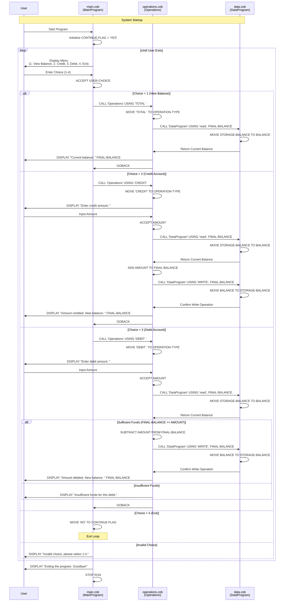

# COBOL Account Management System Documentation

## Overview

This legacy COBOL system implements a simple account management system that allows users to view balances, credit accounts, and debit accounts. The system is designed with a modular architecture consisting of three main programs that work together to provide account management functionality.

## System Architecture

The system follows a three-tier architecture:
- **Presentation Layer**: `main.cob` - User interface and menu system
- **Business Logic Layer**: `operations.cob` - Account operations and business rules
- **Data Layer**: `data.cob` - Data storage and retrieval operations

## File Documentation

### main.cob - Main Program (Entry Point)

**Purpose**: Serves as the primary entry point and user interface for the account management system.

**Key Functions**:
- `MAIN-LOGIC`: Primary program loop that displays the menu and processes user selections
- Menu-driven interface with options for:
  1. View Balance
  2. Credit Account  
  3. Debit Account
  4. Exit

**Key Data Structures**:
- `USER-CHOICE`: Single digit (PIC 9) to store user menu selection
- `CONTINUE-FLAG`: 3-character field (PIC X(3)) to control program loop

**Business Rules**:
- Menu options are restricted to choices 1-4
- Invalid menu selections display an error message
- Program continues until user selects option 4 (Exit)
- All account operations are delegated to the Operations program

### operations.cob - Operations Program (Business Logic)

**Purpose**: Implements the core business logic for account operations including balance inquiries, credits, and debits.

**Key Functions**:
- **Balance Inquiry (`TOTAL`)**: Retrieves and displays current account balance
- **Credit Processing (`CREDIT`)**: Adds funds to the account
- **Debit Processing (`DEBIT`)**: Removes funds from the account with validation

**Key Data Structures**:
- `OPERATION-TYPE`: 6-character field (PIC X(6)) to identify the requested operation
- `AMOUNT`: Monetary field (PIC 9(6)V99) for transaction amounts
- `FINAL-BALANCE`: Current account balance (PIC 9(6)V99) with default value of 1000.00

**Business Rules**:
- **Credit Operations**: 
  - No upper limit validation implemented
  - Accepts any positive amount
  - Updates balance immediately
- **Debit Operations**:
  - **Insufficient Funds Check**: Prevents debits that would result in negative balance
  - Validates available funds before processing transaction
  - Displays error message for insufficient funds
- **Data Persistence**: All balance changes are written to storage via DataProgram

### data.cob - Data Program (Data Layer)

**Purpose**: Handles all data storage and retrieval operations for account balances.

**Key Functions**:
- **Read Operations (`READ`)**: Retrieves current balance from storage
- **Write Operations (`WRITE`)**: Saves updated balance to storage

**Key Data Structures**:
- `STORAGE-BALANCE`: Persistent balance storage (PIC 9(6)V99) with initial value of 1000.00
- `OPERATION-TYPE`: 6-character field (PIC X(6)) to specify read/write operation

**Business Rules**:
- **Initial Balance**: Default account balance is set to $1,000.00
- **Data Persistence**: Balance is maintained in working storage (non-persistent across program runs)
- **Operation Types**: Only supports 'READ' and 'WRITE' operations

## System Business Rules Summary

### Account Management Rules
1. **Initial Account Balance**: All accounts start with $1,000.00
2. **Credit Limits**: No maximum credit limit enforced
3. **Debit Limits**: Cannot debit more than available balance (prevents overdrafts)
4. **Balance Format**: Monetary amounts support up to $999,999.99

### Data Validation Rules
1. **Menu Input**: Only accepts numeric values 1-4 for menu selection
2. **Amount Input**: Accepts monetary amounts up to 6 digits with 2 decimal places
3. **Insufficient Funds**: System prevents overdrafts and displays appropriate error messages

### System Limitations
1. **Single Account**: System manages only one account at a time
2. **No Persistence**: Data is lost when program terminates (working storage only)
3. **No User Authentication**: No security or user identification features
4. **No Transaction History**: No audit trail or transaction logging

## Program Flow

1. **Startup**: Main program initializes with menu display
2. **User Selection**: User chooses operation (1-4)
3. **Operation Routing**: Main program calls Operations with appropriate operation type
4. **Business Logic**: Operations program processes request and calls DataProgram as needed
5. **Data Access**: DataProgram handles read/write operations to storage
6. **User Feedback**: Results are displayed to user
7. **Loop Continuation**: Process repeats until user selects Exit

## Technical Specifications

- **COBOL Standard**: Uses standard COBOL syntax and features
- **Program Communication**: Uses CALL statements with parameter passing
- **Data Types**: Primarily uses PIC 9 (numeric) and PIC X (alphanumeric) data types
- **Memory Management**: Uses WORKING-STORAGE and LINKAGE sections for data handling

## Modernization Considerations

This legacy system could benefit from modernization in the following areas:
- Database integration for persistent data storage
- User authentication and security features
- Multi-account support
- Transaction logging and audit trails
- Web-based or modern UI interface
- Input validation and error handling improvements
- Configuration management for business rules

## User Stories

### Current System User Stories

#### Epic: Account Balance Management
**As a** student  
**I want to** manage my account balance  
**So that** I can track and control my financial transactions

##### US-001: View Account Balance
**As a** student  
**I want to** view my current account balance  
**So that** I know how much money I have available  

**Acceptance Criteria:**
- Given I am on the main menu
- When I select option 1 (View Balance)
- Then the system displays my current account balance
- And I am returned to the main menu

**Current Implementation:** ✅ Implemented in `operations.cob` - TOTAL operation

##### US-002: Add Money to Account (Credit)
**As a** student  
**I want to** add money to my account  
**So that** I can increase my available balance for purchases  

**Acceptance Criteria:**
- Given I am on the main menu
- When I select option 2 (Credit Account)
- Then the system prompts me to enter an amount
- When I enter a valid amount
- Then the system adds the amount to my balance
- And displays my new balance
- And I am returned to the main menu

**Business Rules:**
- No maximum limit on credit amounts
- Amount must be a positive number

**Current Implementation:** ✅ Implemented in `operations.cob` - CREDIT operation

##### US-003: Remove Money from Account (Debit)
**As a** student  
**I want to** remove money from my account  
**So that** I can make purchases or withdrawals  

**Acceptance Criteria:**
- Given I am on the main menu
- When I select option 3 (Debit Account)
- Then the system prompts me to enter an amount
- When I enter a valid amount that is less than or equal to my balance
- Then the system subtracts the amount from my balance
- And displays my new balance
- And I am returned to the main menu

**Business Rules:**
- Cannot debit more than available balance
- System prevents overdrafts
- Must display error message for insufficient funds

**Current Implementation:** ✅ Implemented in `operations.cob` - DEBIT operation with validation

##### US-004: Exit Application
**As a** student  
**I want to** exit the application safely  
**So that** I can close the program when finished  

**Acceptance Criteria:**
- Given I am on the main menu
- When I select option 4 (Exit)
- Then the system displays a goodbye message
- And the program terminates cleanly

**Current Implementation:** ✅ Implemented in `main.cob` - EXIT option

##### US-005: Handle Invalid Menu Selections
**As a** student  
**I want to** receive clear feedback for invalid menu choices  
**So that** I understand how to use the system correctly  

**Acceptance Criteria:**
- Given I am on the main menu
- When I enter an invalid option (not 1-4)
- Then the system displays an error message
- And I remain on the main menu to try again

**Current Implementation:** ✅ Implemented in `main.cob` - Input validation

### Future Enhancement User Stories

#### Epic: User Authentication & Security
##### US-006: User Login
**As a** student  
**I want to** log into the system with my credentials  
**So that** only I can access my account information  

**Acceptance Criteria:**
- Given I start the application
- When I enter my username and password
- Then the system authenticates my credentials
- And grants access to my personal account
- Or displays an error for invalid credentials

**Priority:** High  
**Current Implementation:** ❌ Not implemented (single account system)

##### US-007: Account Security
**As a** student  
**I want to** have my session automatically timeout  
**So that** my account remains secure if I forget to log out  

**Acceptance Criteria:**
- Given I am logged into the system
- When I am inactive for more than 15 minutes
- Then the system automatically logs me out
- And requires re-authentication for access

**Priority:** Medium  
**Current Implementation:** ❌ Not implemented

#### Epic: Enhanced Account Features
##### US-008: View Transaction History
**As a** student  
**I want to** view my transaction history  
**So that** I can track my spending and deposits over time  

**Acceptance Criteria:**
- Given I am logged into my account
- When I select "View Transaction History"
- Then the system displays a list of my recent transactions
- Including date, type (credit/debit), amount, and resulting balance

**Priority:** High  
**Current Implementation:** ❌ Not implemented (no transaction logging)

##### US-009: Set Account Alerts
**As a** student  
**I want to** set up balance alerts  
**So that** I'm notified when my balance falls below a certain amount  

**Acceptance Criteria:**
- Given I am in account settings
- When I set a minimum balance threshold
- Then the system warns me when my balance approaches this limit
- And prevents transactions that would exceed the threshold if desired

**Priority:** Medium  
**Current Implementation:** ❌ Not implemented

##### US-010: Transfer Between Accounts
**As a** student  
**I want to** transfer money between different account types  
**So that** I can manage multiple accounts (checking, savings, meal plan)  

**Acceptance Criteria:**
- Given I have multiple accounts
- When I select "Transfer Funds"
- Then I can choose source and destination accounts
- And transfer a specified amount between them
- With appropriate balance validations

**Priority:** Medium  
**Current Implementation:** ❌ Not implemented (single account only)

#### Epic: Reporting & Analytics
##### US-011: Monthly Spending Report
**As a** student  
**I want to** generate monthly spending reports  
**So that** I can better understand my spending patterns  

**Acceptance Criteria:**
- Given I have transaction history
- When I request a monthly report
- Then the system generates a summary showing:
  - Total credits and debits for the month
  - Spending categories (if applicable)
  - Average daily balance
  - Comparison to previous months

**Priority:** Low  
**Current Implementation:** ❌ Not implemented

##### US-012: Export Account Data
**As a** student  
**I want to** export my account data  
**So that** I can import it into personal finance software  

**Acceptance Criteria:**
- Given I have account data
- When I select "Export Data"
- Then the system generates a downloadable file (CSV, PDF)
- Containing my transaction history and account information

**Priority:** Low  
**Current Implementation:** ❌ Not implemented

#### Epic: System Administration
##### US-013: Account Recovery
**As a** student  
**I want to** recover my account if I forget my password  
**So that** I don't lose access to my financial information  

**Acceptance Criteria:**
- Given I have forgotten my password
- When I select "Forgot Password"
- Then the system guides me through a secure recovery process
- Using email verification or security questions

**Priority:** High  
**Current Implementation:** ❌ Not implemented

##### US-014: Data Persistence
**As a** student  
**I want to** have my account data saved permanently  
**So that** my balance and history are maintained between sessions  

**Acceptance Criteria:**
- Given I make transactions in the system
- When I log out and log back in later
- Then my balance and transaction history are preserved
- And reflect all previous activities

**Priority:** High  
**Current Implementation:** ❌ Not implemented (data lost on program exit)

### Technical User Stories

#### Epic: System Modernization
##### US-015: Web Interface
**As a** student  
**I want to** access the system through a web browser  
**So that** I can manage my account from any device  

**Priority:** Medium  
**Current Implementation:** ❌ Terminal-based interface only

##### US-016: Mobile Compatibility
**As a** student  
**I want to** use the system on my mobile device  
**So that** I can check my balance and make transactions on the go  

**Priority:** Medium  
**Current Implementation:** ❌ Not mobile-friendly

##### US-017: API Integration
**As a** system administrator  
**I want to** integrate with external financial systems  
**So that** students can link their campus accounts with banking services  

**Priority:** Low  
**Current Implementation:** ❌ No API capabilities

## System Data Flow Diagram

The following sequence diagram illustrates the data flow and interactions between the three COBOL programs for different operations:

### Key Data Flow Patterns

1. **Menu-Driven Architecture**: All user interactions flow through the main program's menu system
2. **Operation Delegation**: Main program delegates all business logic to the Operations program
3. **Data Abstraction**: Operations program never directly accesses data - all data operations go through DataProgram
4. **Parameter Passing**: Programs communicate via CALL statements with parameters
5. **State Management**: Current balance is maintained in DataProgram's STORAGE-BALANCE
6. **Error Handling**: Business rule validation (insufficient funds) occurs in Operations program

### Program Interaction Summary

- **User ↔ Main**: Menu display and input handling
- **Main → Operations**: Operation requests with operation type parameters
- **Operations ↔ Data**: Read/write balance operations
- **Operations → User**: Transaction results and error messages