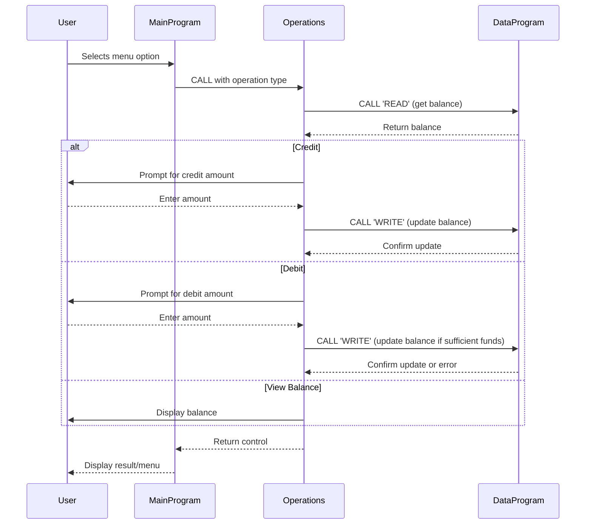

# COBOL Accounting System Documentation

This document describes the structure and business logic of the school's accounting system implemented in COBOL. The system manages student account balances, allowing users to view, credit, and debit accounts through a simple menu interface.

## File Overview

### 1. `data.cob`
**Purpose:**
- Manages persistent storage and retrieval of the account balance.
- Provides a callable interface to read or write the current balance.

**Key Functions:**
- `READ` operation: Returns the current stored balance.
- `WRITE` operation: Updates the stored balance with a new value.

**Business Rules:**
- The balance is stored in `STORAGE-BALANCE` and is updated only via explicit `WRITE` operations.

---

### 2. `main.cob`
**Purpose:**
- Acts as the entry point and user interface for the accounting system.
- Presents a menu to the user for account operations.

**Key Functions:**
- Displays options: View Balance, Credit Account, Debit Account, Exit.
- Accepts user input and calls the `Operations` program with the selected action.

**Business Rules:**
- Only valid menu choices (1-4) are accepted; invalid choices prompt the user again.
- The program continues running until the user selects Exit.

---

### 3. `operations.cob`
**Purpose:**
- Implements the core business logic for account operations.
- Handles viewing, crediting, and debiting the account balance.

**Key Functions:**
- `TOTAL`: Calls `DataProgram` to read and display the current balance.
- `CREDIT`: Prompts for an amount, adds it to the balance, and updates storage.
- `DEBIT`: Prompts for an amount, checks for sufficient funds, subtracts from the balance if possible, and updates storage.

**Business Rules:**
- Credit and debit operations always read the latest balance before updating.
- Debit operations are only allowed if sufficient funds are available; otherwise, an error message is displayed.
- All balance updates are persisted via the `DataProgram`.

---

## Summary of Business Logic
- The system ensures that all account operations are validated and that the balance cannot go negative.
- All changes to the balance are made persistent through the `data.cob` module.
- The user interface is simple and menu-driven, suitable for basic student account management tasks.

---

For further details, refer to the source code in the `/src/cobol/` directory.

---

## Sequence Diagram: Data Flow

